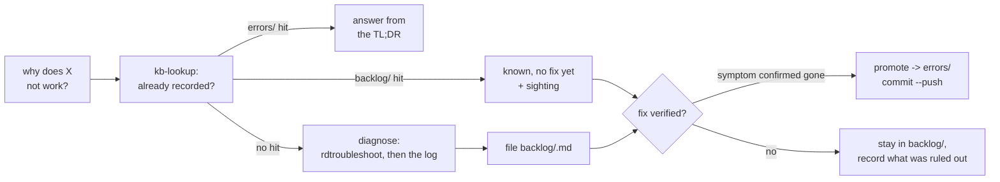

# CLAUDE.md — retrodeck-troubleshoooter

Read-only diagnostics for **RetroDECK emulation and ROM-metadata scraping** on Fedora
Atomic (Bazzite). A stdlib-only Python CLI, `rdtroubleshoot`, plus the documented findings
behind every check it makes.

It is the companion to the retrodeck-scraper project,
which does the scraping. That project's `CLAUDE.md` carries the matcher's reasoning; this
one carries what to do when something is broken on the machine.

## Working agreement (read this first, whichever agent you are)

This file is `AGENTS.md` too — the same bytes through a symlink — so Claude Code and Codex
both read it, and both are expected to work the same way here.

- **Nothing in this repository writes anything.** No gamelist, no config, no media, no
  network request, no emulator started. That is what makes it safe to run while RetroDECK
  is open, which is exactly when a user wants to ask what is wrong. A check that would
  need to mutate something to answer its question does not belong here; put the fix in the
  `fix` field of the `Check` and let a human type it.
  - The single exception is `--probe-sandbox`, which starts an app's Flatpak *runtime* to
    run `sh`. It launches no emulator and writes nothing. It is opt-in because it is slow,
    not because it is risky.
- **A state is not a fault.** RetroDECK being open, `/` being 100% full on an ostree
  composefs, SELinux denying sshd a control socket, a stopped distrobox, a hand-labelled
  backup — all normal here. A checker whose exit code fires on those trains its user to
  ignore it, and then the 0/1/2 contract is worth nothing. Anything normal-but-worth-knowing
  is **INFO**. This is the rule most likely to be broken by a well-meaning new check; two
  of the three defects found while writing this tool were exactly that.
- **Verify by running it, and quote the number.** `./tools/check.sh` is compile + the
  suite. But the suite is not the proof: two of the three real defects in the first draft
  were found by running the CLI on a machine where RetroDECK is absent (a 1 GiB ESP
  reported `FAIL` on disk space) and on the box itself. Run it both places.
- **Record what you found here.** This file is the project's memory. A finding that lands
  without a note here is one the next session re-derives — which is how the disk-topology
  error below survived in the scraper's notes for weeks.
- **Stdlib only, and it is enforced.** `tests/test_stdlib_only.py` walks the AST of every
  module and asserts `pyproject.toml` declares no dependencies. An import inside a function
  body is still an import. The box is immutable Fedora Atomic: a runtime dependency there
  is a distrobox or a vendored copy, not a `pip install`.
- **Never print a secret, and never put one on a command line.** Not the ScreenScraper
  password, not its length, not the sudo password. `/proc` makes argv world-readable, so
  `env.sudo_run` feeds `sudo -S` on stdin; `Credentials.__repr__` is overridden because the
  default dataclass one would render the password into any traceback. Pinned by
  `tests/test_env.py`, which asserts the secret appears in no `Check` field.
- **A hazard must not be validated by acting on it.** A group- or world-readable `.env` is
  reported FAIL *and* its secrets are withheld — including at the point of use, not only in
  the report. Warning and proceeding would tell the user everything is fine while their root
  password sits in a file anyone on the box can read.
- **Privilege is optional, and its absence is not a fault.** No `.env` means the privileged
  checks say what they could not inspect and why; the exit code does not move. `env.py` is
  the single place that decides whether a secret may be used, and credentials are loaded
  once in `cli.main` and passed down, so no check module reads the file itself.
- **A problem solved once must stay solved, so the session ends in the knowledge base.**
  `docs/kb/` is the point of this repository, not an appendix to it. Every troubleshooting
  session that learned something ends with an entry, a sighting, or a `_skipped.md` line —
  see the operating model below. A finding that lives only in a chat transcript is one the
  next session pays for again.
- **Evidence commits freely; a fix does not.** A sighting or a new `backlog/` entry is an
  observation, and being wrong about an observation costs a later correction. Promoting to
  `errors/` tells the next person to *do* something, so it needs the symptom seen, the fix
  applied, and the symptom **confirmed gone**. `rdtroubleshoot kb check` enforces that with
  a mandatory `verified:` / `verified_by:` pair, and `kb commit` refuses on a lint failure
  or a red suite. Do not reach for `--skip-tests` to get past the gate.
- **Never present a plausible fix as a verified one.** "It should work" and "the command
  exited 0" are not verification. An unverified claim in an `errors/` entry is worse than no
  entry, because it is trusted. Leaving a case in `backlog/` with an honest account of what
  was ruled out is a good outcome, not a failure.
- Commit messages are prose that says what was measured and why, not a subject line.

## Skills, and why they are listed here

Claude Code discovers a skill by scanning `.claude/skills/`. **Codex has no equivalent** —
measured against codex-cli 0.146.0 by putting a distinct token in each candidate location
and asking it which it could see:

| location | Codex reads it |
|---|---|
| root `AGENTS.md` | **always** |
| `<subdir>/AGENTS.md`, invoked from the repo root | no |
| `<subdir>/AGENTS.md`, invoked from that subdir | yes |
| `.agents/AGENTS.md` | **never** — there is no such convention |

So the only thing both agents reliably read is this file, which Codex sees as `AGENTS.md`
through the symlink. **That is why the skills are listed below rather than merely existing
on disk**: the list *is* the discovery mechanism for half the agents working here.
`tests/test_skills.py` fails if a skill directory is not listed, so the two cannot drift.

Each skill directory also carries an `AGENTS.md` symlink to its own `SKILL.md`, which the
table above shows is read when Codex is invoked from inside that directory. A convenience,
not the mechanism.

| skill | what it is for |
|---|---|
| [`diagnose-emulation`](.claude/skills/diagnose-emulation/SKILL.md) | A game that will not launch, a black screen, missing art, an unrecognised pad. |
| [`diagnose-scraping`](.claude/skills/diagnose-scraping/SKILL.md) | A scrape that produced nothing, thin or wrong metadata, credentials, quota. |
| [`diagnose-host`](.claude/skills/diagnose-host/SKILL.md) | SELinux, Flatpak sandboxes and overrides, ostree, brew, distrobox, disks. |
| [`read-retrodeck-logs`](.claude/skills/read-retrodeck-logs/SKILL.md) | Reading the logs correctly: rotation format, noise, the lines that matter. |
| [`kb-lookup`](.claude/skills/kb-lookup/SKILL.md) | **The dedup pre-flight — run this before diagnosing anything.** Match a symptom against what is already recorded. |
| [`document-finding`](.claude/skills/document-finding/SKILL.md) | Record a finding: file an open case, add a sighting, or promote a verified fix and push it. |

## The operating model

One loop, and it is the whole point of the repository:

> Somebody asks "why does X not work". You check what is already recorded, diagnose only what
> is genuinely new, and end by writing down what you learned — as an open case if there is no
> fix yet, or as a verified fix if there is. A verified fix gets pushed.



**The pre-flight comes first.** Re-investigating a recorded symptom is the most common waste
available and it costs three commands to avoid. The `kb-lookup` skill is that step.

**The KB is executable, which is what makes this more than a folder of prose.** Every entry
carries machine-matchable `signatures:`, so:

- `rdtroubleshoot kb match <log>` routes a log to entries with no human in the loop;
- `rdtroubleshoot --kb` annotates each WARN/FAIL with the entries that cover it.

That second one works only because **a KB area *is* a checker group** (`os`, `flatpak`,
`emulation`, `input`, `scraping`). The coupling is deliberate: it lets a finding point at what
is already known, and lets an entry name the check that verifies its fix. Do not add an area
without a corresponding group, and do not rename a group without the areas.

**Two states, one gate.** `backlog/` is a case with no fix; `errors/` is a case with a
verified one. The one-sentence test: if you can tell somebody what to *do*, it is an `errors/`
entry. Promotion is the only gated step, and the gate is code — `verified:`, `verified_by:`,
an eval fixture, a clean lint and a green suite, all enforced by `kb check` and `kb commit`
rather than by anyone remembering.

**Push access is probed, not assumed.** `kb commit --push` runs `git push --dry-run`, which
authenticates and writes nothing. With access it pushes to `main`; without it, the work moves
to a branch `kb/<slug>` and the fork-and-PR commands are printed. So a contributor who is not
the repository owner gets a pull request automatically, and no username is hardcoded anywhere.

Full conventions, the frontmatter subset and the signature sources: [`docs/kb/README.md`](docs/kb/README.md).
Contributor-facing version: [`CONTRIBUTING.md`](CONTRIBUTING.md).

### Why this shape

It is lifted from a support-desk repository that has been through roughly sixty entries, and
these are the parts that survived that contact:

- **Two states, promotion only on verification.** Everything else follows from it.
- **The slug names the dominant symptom, not the cause.** Causes get re-diagnosed; symptoms
  are what somebody greps for a year later.
- **Single sightings are welcome.** Filing a one-off precisely is the only thing that makes a
  *second* sighting recognisable — and the second sighting is the cue to fix it.
- **An entry with no INDEX row is invisible.** So the lint fails on it, because relying on
  memory here was tried and did not hold.
- **One entry, many INDEX rows** — one per way somebody might describe the failure.
- **Correcting an entry is normal.** A commit that only retracts an earlier claim is a good
  commit.

What is different here, besides the executable signatures: there is no support channel, so
intake is the user asking directly and the evidence is a local log rather than a job URL; and
storage nests by area (a human browses this tree on the web) while **routing stays flat**,
because an index that branches is one you search twice.

## Layout

```
rdtroubleshoot              entrypoint; puts src/ on the path itself, no install needed
src/rdtroubleshoot/
  probe.py                  Check/Report, levels, the 0/1/2 contract, shell + log helpers
  env.py                    optional .env credentials; the only place a secret is handled
  paths.py                  where RetroDECK keeps things; never resolves a path
  gamelist.py               reads a gamelist, including ES-DE's two-root form
  osquery.py                SELinux, ostree, disks, brew, distrobox
  flatpakq.py               installs, sandbox reachability, overrides
  emulation.py              layout, gamelists, logs, BIOS, Switch, Model 3
  inputs.py                 controllers, and the Ryujinx GUID derivation
  scraping.py               Skyscraper, credentials, cache, quota, coverage
  cli.py                    argument parsing, group dispatch, and the --kb annotation
  kb.py                     KB entries, frontmatter, signature matching, and the lint
  kb_ops.py                 KB writes: new / sighting / promote, and the commit gate
  kb_cli.py                 the `rdtroubleshoot kb ...` subcommand tree
docs/
  kb/                       the knowledge base — see docs/kb/README.md
    errors/<area>/           cases with a verified fix
    backlog/<area>/          open cases, no fix yet
    evals/                   the recorded case that proved each fix
  EMULATION.md              reference docs: the findings, with the measurements behind them
tests/                      stdlib unittest; no network, no box required
tools/check.sh              compile + suite
```

## Usage

```sh
./rdtroubleshoot                      # every group
./rdtroubleshoot emulation input      # just these
./rdtroubleshoot -q                   # only WARN and FAIL
./rdtroubleshoot --json               # machine-readable
./rdtroubleshoot os --show-benign     # include the known-benign SELinux denials
./rdtroubleshoot flatpak --probe-sandbox
./rdtroubleshoot --guid 0003 054c 05c4 8111    # derive a Ryujinx controller id
./rdtroubleshoot env                  # which .env keys were found (names, never values)
./rdtroubleshoot --no-env             # ignore .env; skip every privileged check
./rdtroubleshoot --kb                 # annotate each WARN/FAIL with the entries covering it
./rdtroubleshoot kb search "black screen"
./rdtroubleshoot kb match ~/.var/app/net.retrodeck.retrodeck/config/retrodeck/logs/retrodeck.log
./rdtroubleshoot kb check             # the lint, and the commit gate
```

Exit **0** healthy, **1** warnings, **2** failures. `--help`'s epilog is the authoritative
list of groups and environment variables.

## What each check stands for

Every check exists because of a specific failure that cost someone a session. The full
accounts are in `docs/`; this is the index.

- **`userCreds="user:"` is worse than anonymous** — an empty password on every request,
  login refused, nothing scraped, and a blacklist risk from repeated bad logins. It cost a
  silent 4–5 hour `nohup`'d run. Hence **FAIL**, not WARN.
- **A black screen after loading is an unbound pad**, not the GPU. `Hid Remap: No matching
  controllers found` at `|W|` severity, repeating every two seconds, while audio works and
  four shaders compile. The pad was connected and *visible*; it had no matching profile.
- **`mesa_glthread` is logged at `|E|` by Ryujinx and is noise.** Unfiltered it drowns every
  real error in the file.
- **`/home` vs `/var/home` is not cosmetic.** ES-DE and Skyscraper match gamelist entries by
  the raw `<path>` string; generating `model2` under the resolved spelling lost 7 of 59
  descriptions and 22 playcount tags. Nothing here resolves a path, and `paths.py` says so
  in its docstring so the next person does not "tidy" it.
- **A gamelist can have two root elements.** ES-DE writes `<alternativeEmulator>` as a
  sibling of `<gameList>` when an emulator override is set. ES-DE accepts it; `ElementTree`
  refuses the file entirely, which in the scraper presented as one folder failing on every
  run. A checker that calls it corrupt reports a fault on a working system.
- **Quota exhaustion exits 0.** All four messages Skyscraper prints before giving up leave
  the status at zero, so the log text is the only signal. Match **full sentences**: short
  substrings missed two of the four *and* false-positived on a game description containing
  "Get a bigger quota!".
- **Descriptions were never the whole gap.** One folder read 98% described and 45% un-genred
  at the same time; a single run took its genre coverage from 55% to 99% while the
  descriptions barely moved. Coverage is counted per tag for that reason.
- **A 52-byte stub `db.xml`** means an empty resource cache, so `generate` there publishes
  nothing and needs a quota-spending gather first.
- **Count only the rotation's own backups.** A hand-labelled checkpoint is one the rotation
  may not delete; counting those made the scraper's equivalent check WARN permanently while
  the rotation worked exactly as specified.
- **The pgrep pattern must be bracketed.** `[e]s-de|...` — unbracketed, pgrep matches its own
  command line and reports RetroDECK running when it is not. This bit us over SSH.
- **An update NSP is not a game.** `...800` contains no application and can never launch.
  Never delete one: Ryujinx references it by path. Mark it `<hidden>`.
- **Both halves of the Supermodel workaround are load-bearing** — the `cd` so `Assets/`
  resolves, and `WAYLAND_DISPLAY=` so it takes its working X11/OpenGL path.

### Host findings, measured on the box 2026-08-28

- **`/` is 100% full and always will be** — a 45 MB read-only composefs image, on a machine
  with hundreds of GiB free. Any `df` check that does not skip pseudo filesystems reports
  disk here.
- **SELinux is Enforcing and there are real denials, all benign**: `sshd-session` creating a
  `sock_file` in `ssh_home_t`, on every connection — an upstream policy gap hit by SSH
  multiplexing. Filtered by default because it buries anything real. The filter is a
  `(comm, tclass, tcontext)` triple, so a denial from anything else still surfaces.
- **Homebrew is installed and not on PATH.** `/home/linuxbrew/.linuxbrew` exists while
  `command -v brew` finds nothing over `ssh host 'cmd'`. Reported INFO with the `shellenv`
  line, because it is not a broken install.
- **The disk topology in the scraper's CLAUDE.md is backwards.** Live `lsblk`: the ROM
  volume is the whole of **`nvme0n1`** (btrfs, label RetroDECK, no partition table) and the
  OS is **`nvme1n1p3`** (btrfs, label bazzite) — the reverse of what that file claims.
  Neither is LUKS. `osquery.py` reports the live topology rather than asserting either
  version, which is how the discrepancy surfaced at all.
- **RetroDECK's sandbox is not a blocker for anything**: `filesystems=host`, `devices=all`.
  **Ryujinx has `home:ro`** — it can load a ROM from `~/retrodeck` and cannot write a save
  beside it. Supermodel has `home;host:ro`.
- **The ROM tree is its own filesystem** mounted under `$HOME`, so a `filesystems=home`
  grant carries a submount along while a grant of some specific other `~/subdir` does not.
- **udev grants input access by ACL to the *seated* user**, not by group membership, and an
  SSH session is not seated. So `input` checks can correctly report "not readable by you"
  while the desktop session is fine — reported **INFO**, with that caveat stated.
- **`joydev` and `uinput` are loaded; no `hid_sony`/`hid_playstation` is.** No pad was
  connected at survey time, which is consistent with `/dev/input/js*` being absent.

## Defects found by running it, not by reading it

Seven, and every one of them was invisible to the suite. Four were found by the first live
run on the box, three by running on a machine with no RetroDECK at all. They share a shape
worth recognising: a rule that is right in general and wrong for one input.

### Found on the dev machine (no RetroDECK, no Flatpak, no SELinux)

1. **A 1 GiB EFI system partition reported `FAIL` on disk space.** The tens-of-GiB rule is
   right for the volume holding ROMs and media and nonsense everywhere else. Thresholds are
   now per-filesystem: strict for the mounts actually carrying ROMs/media/gamelists,
   proportional elsewhere, never FAIL for a filesystem that could not hold a ROM anyway.
   This was the "a state is not a fault" rule being broken by the same commit that wrote it.
2. **The inherited disk-topology note was simply wrong** (see the host findings above).
   Reporting the live value rather than restating the note is what caught it.
3. **`test_skills`' frontmatter regex was missing `(?m)`**, so `^name:` matched nothing —
   a guard that could not fire.

### Found by the first live run on the box, 2026-08-28

4. **Four SELinux denials were reported as warnings, and all four had blocked nothing.**
   The AVC line carries `permissive=1` when the *domain* is permissive, and Bazzite ships
   `bootupd_t` permissive — so `lsblk` is denied a read on `/proc/swaps` at every boot and
   nothing breaks. The regex ignored the field. Parsing it is strictly better than adding
   `lsblk` and `bootupctl` to `BENIGN_DENIALS`, because it is a general rule about what a
   denial *means* rather than a list of programs that will need extending for ever. Enforced
   denials still WARN; the permissive ones are one INFO line with counts.
5. **`/var/home` was reported as `/etc`**, under the ostree deploy path
   `/dev/nvme1n1p3[/root/ostree/deploy/default/deploy/<deploy-checksum>/etc]`. On an ostree host
   `/etc`, `/var`, `/var/home` and `/sysroot` are all one btrfs, and deduplicating on
   `total:free` kept whichever `findmnt` listed first. It now prefers a target that carries
   ROMs or media, then the shortest path — which is the real mount rather than a
   deploy-specific bind. The bug was not the deduplication but the arbitrary winner.
6. **`Image booted ? version 44.20260825`** — `origin` is absent on a container-native
   deployment, and `dict.get(k, "?")` printed the placeholder. It now falls back to
   `container-image-reference` and says nothing when neither exists. Live value:
   `ostree-image-signed:docker://ghcr.io/ublue-os/bazzite-nvidia:stable`.
7. **Six coverage WARNs for nine missing tags.** `doom` (4 entries), `dragon32`, `neogeocd`,
   `pc`, `quake`, `windows3x` (1 each) — and most are folders the scraper deliberately
   ignores because they are not Skyscraper platforms at all. Six warning lines about that is
   precisely the chatter that teaches a user to ignore the exit code. Folders under
   `MIN_ENTRIES_TO_WARN` (8) now fold into one INFO line.

Both of the last two guards were proved by breaking them and watching the suite fail:
dropping the `permissive=` capture group gives 3 errors, and setting
`MIN_ENTRIES_TO_WARN = 0` gives 1 failure.

## The live run, 2026-08-28

Deployed by rsync to `/var/home/retro/apps/retrodeck-troubleshoooter/` and run there under
python 3.14.7. The suite passes on the box unchanged (67 tests), which is the point of it
needing neither the network nor a RetroDECK install.

**After the four fixes, `os` + `scraping` went from 12 warnings to 2**, and both survivors
are real: Skyscraper is present at `~/skysource/Skyscraper` and not on PATH, and one folder
has a genuine coverage gap that the scraper's own notes already record — a large share of
its files carry **no extension at all**, so a format filter cannot see them and the gamelist
is complete for what the tools can find. Fix by renaming to a real format suffix, never by
admitting an empty one.

What the full run establishes about the machine, none of which needed a warning:

- **Every gamelist on the machine parsed** — so no folder currently carries ES-DE's two-root
  `<alternativeEmulator>` form, and none mixes the `/home` vs `/var/home` spellings. Those
  are the two failures that make a working gamelist look corrupt, so a clean sweep here is
  the useful result.
- **RetroDECK's sandbox is not a blocker for anything**: `filesystems=host`. **Ryujinx's
  `home:ro` is**, and it is now reported with the override command — it can load a ROM from
  `~/retrodeck` and cannot write a save beside it. Supermodel reaches the tree via `home`.
- **The Supermodel launcher still has both halves** of the Model 3 workaround.
- **The DualShock 4 profile is bound** — `Player1=PS4 Controller (0)`, `Player2=All
  Keyboards` — so the black-screen fix recorded for 2026-08-16 is still in place. No pad is
  connected at present, and the tool says the bindings cannot be checked against one rather
  than guessing.
- **Two Switch update NSPs** are present and correctly identified as containing no
  application, with "do not delete these" in the fix line.
- **No real `|E|` lines** in the log tail, and most systems fully described and genred.
- All three system Flatpaks carry a `system/global` override file, which is worth knowing
  before blaming an app's own manifest for a permission.

**`--probe-sandbox` confirms the static model, including on the one question where it could
plausibly have been wrong.** All three apps really can read `~/retrodeck` from inside their
sandbox — so a `filesystems=home` grant *does* carry a separate filesystem mounted under
`$HOME` along with it, which is what the ROM volume is here. The whole run costs 3 seconds,
so it is opt-in for tidiness rather than expense. Keep both: the static analysis explains
*why* (it can name the grant, and tell `ro` from `rw`), the probe establishes *whether*.

**`-q` across the whole machine is three lines.** That is the number worth defending — a
checker that prints 60 lines has no exit code worth reading.

## Verifying a change

```sh
./tools/check.sh                                   # compile + suite
./rdtroubleshoot --no-color                        # on the dev machine: must degrade, not crash
ssh -o BatchMode=yes retro@retrodeck-box \
  '~/apps/retrodeck-troubleshoooter/rdtroubleshoot --no-color'   # and on the box
```

Both machines matter and they exercise different halves. The dev machine has no RetroDECK,
no flatpak, no SELinux — so it proves every check degrades to INFO rather than raising or
crashing. The box is the only place the real answers appear.

`tests/` needs neither the network nor the box. Run it with
`python3 -m unittest discover -s tests -b`.

## The user's setup

- **Target machine:** a Lenovo IdeaPad Gaming 3 15ARH05 running
  **Bazzite 44 (Kinoite)** — Fedora Atomic, immutable. 12 cores, 48 GB DDR4, GTX 1650 Ti
  Mobile, python 3.14.7.
- **SSH from the dev machine:** `ssh -o BatchMode=yes retro@retrodeck-box`. Do **not** use
  SSH's `-b` or set `BindAddress`; let routing pick the source address. Same for `scp` and
  `rsync`. The remote user's home is `/var/home/retro` — and `$HOME` is `/home/retro`,
  a symlink to it, which is the path-prefix trap above.
- **Deployed to** `/var/home/retro/apps/retrodeck-troubleshoooter/` — rsync after every
  change. It has no dependencies, so deploying is a file copy and nothing else.
- **RetroDECK** is a system Flatpak, `net.retrodeck.retrodeck` 0.10.9b, `~/retrodeck/ES-DE/`
  layout.
- This repository is public, so nothing identifying belongs in it: no usernames, host
  names, LAN addresses, account names or secrets, in the tree **or in the history**. Paths
  in examples use `/home/<user>` and a `retrodeck-box` placeholder; `.env` is gitignored and
  `.env_template` ships every key empty. `tests/test_env.py` asserts the template sets no
  password, and that every key the code reads is documented in it.
