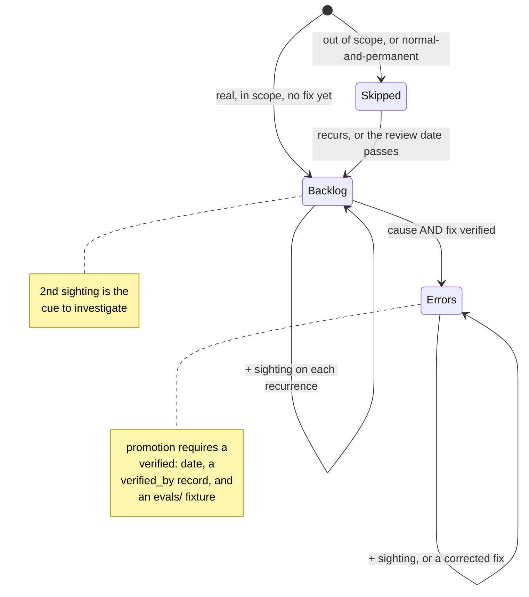
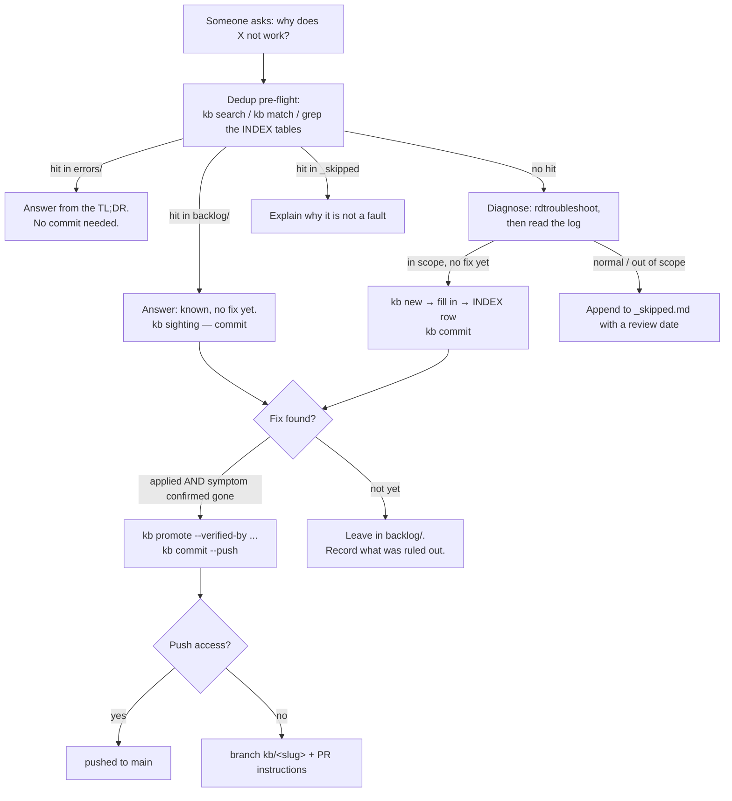

# The knowledge base

Recorded symptoms, their machine-matchable signatures, and — once verified — their fixes.

The structure is borrowed from a support-desk repository that has been through roughly sixty
entries, because the parts that survive that kind of contact are worth copying rather than
re-deriving. What is new here is that the entries are **executable**: each carries
signatures that `rdtroubleshoot kb match` greps live logs against, so a log can route
itself to an entry without anyone reading an index.

## The two states

| | `backlog/` | `errors/` |
|---|---|---|
| means | we have seen this, **no verified fix** | we know what to do |
| TL;DR says | "known, unresolved" | the action, first |
| `status:` | `open` | `fixed` |
| `verified:` | must be **absent** | **required** |
| eval fixture | none yet | **required** |

**One-sentence test:** if you can tell somebody what to *do*, it is an `errors/` entry; if
all you can honestly say is "seen it, no fix yet", it is a `backlog/` entry.

Both are useful. "We know about this and there is no fix" is a real answer, and a much
better one than an invented fix or a request to re-describe a problem already on file.

## Two rules that carry most of the weight

**The slug names the dominant symptom, not the cause.** Causes get re-diagnosed; symptoms
are what someone greps for a year later. `ryujinx-black-screen-after-loading`, not
`ryujinx-unbound-controller-profile`.

**Single sightings are welcome.** Filing a one-off precisely is the only thing that makes a
*second* sighting recognisable as a pattern — and the second sighting is the cue to go and
fix it. Do not wait for a case to look important before recording it.

## Layout

```
docs/kb/
  README.md                     this file
  errors/
    INDEX.md                    flat routing table — scanned FIRST
    _template.md
    <area>/<slug>.md
  backlog/
    INDEX.md                    flat routing table — scanned second
    _template.md
    _skipped.md                 append-only ledger of deliberate non-filings
    <area>/<slug>.md
  evals/
    _template.md
    <slug>.md                   the recorded case that proved a fix
```

`<area>` is one of **`os`, `flatpak`, `emulation`, `input`, `scraping`** — exactly the
checker's group names. That coupling is deliberate and load-bearing: it is what lets
`rdtroubleshoot --kb` annotate a failing check with the entries that cover it, and what lets
an entry name the check that verifies its fix. Do not add an area without a corresponding
group.

**Storage nests by area; routing stays flat.** Nesting helps a human browsing the tree, but
an index that branches is an index you have to search twice, so both `INDEX.md` tables are
single flat tables across all areas.

## The lifecycle



## The flow, from a question to a pushed fix



The **dedup pre-flight comes before diagnosis**, not after. Re-investigating a recorded
symptom is the most common waste there is, and it is entirely avoidable.

## The verification gate

An `errors/` entry tells the next person to *do* something, so publishing one is the only
step here with a real gate. Three things must hold, and `rdtroubleshoot kb check` enforces
all three rather than trusting anyone to remember:

1. `status: fixed` and the file lives under `errors/`.
2. `verified: YYYY-MM-DD` **and** `verified_by:` — free text naming *how* anyone knew it
   worked: a check name, a command, or an observation.
3. An `evals/<slug>.md` fixture recording the case that proved it.

What counts as verified: the symptom was **observed**, the fix was **applied**, and the
symptom was then **confirmed gone**. "It should work" is not verification, and neither is
"the command ran without error" — the `### Verification` section has to say what was seen.

Evidence commits freely; fixes do not. A sighting or a new `backlog/` entry is an
observation, and being wrong about an observation costs a later correction. Being wrong
about a fix costs somebody else's afternoon.

## Frontmatter

A deliberately restricted YAML subset: top-level scalars, plus top-level keys holding a list
of flat mappings. **No deeper nesting, no multi-line scalars.** The project is stdlib-only,
so a real YAML parser is not available; rather than pretend otherwise, the subset is
documented and the lint fails on anything outside it.

```yaml
---
slug: ryujinx-black-screen-after-loading   # == the filename stem
area: input                                 # == the directory, and a checker group
status: fixed                               # open | fixed
first_seen: 2026-08-16
last_confirmed: 2026-08-28
verified: 2026-08-16                        # errors/ only
verified_by: the game drew its title screen after the pad was bound
signatures:
  - source: retrodeck-log
    pattern: Hid Remap: No matching controllers found
    note: repeats every two seconds; logged at |W|, not |E|
---
```

`pattern` is a **regex**, matched case-insensitively. A value containing `:` is fine — only
the first colon splits the key.

### Signature sources

| source | matched against |
|---|---|
| `retrodeck-log` | the RetroDECK / emulator log |
| `bios-log` | `retrodeck_bios_check.log` |
| `journal` | the systemd journal |
| `ryujinx-config` | Ryujinx `Config.json` |
| `gamelist` | any ES-DE `gamelist.xml` |
| `checker` | an `rdtroubleshoot` check **name** — this is what `--kb` matches |
| `symptom` | prose for a human; **never** matched mechanically |

Every entry needs at least one non-`symptom` signature, or nothing can ever route to it from
a log. The lint enforces that.

## Commands

```sh
rdtroubleshoot kb list                       # every entry, fixed first
rdtroubleshoot kb search "black screen"      # slug, title, TL;DR and signatures
rdtroubleshoot kb match <log>                # route a log to entries
rdtroubleshoot kb match - --source journal   # or stdin, from another source
rdtroubleshoot kb check                      # the lint — this IS the commit gate
rdtroubleshoot --kb                          # annotate each WARN/FAIL with its entries

rdtroubleshoot kb new --area input --slug ... --title '...'
rdtroubleshoot kb sighting <slug> "what was seen, and where"
rdtroubleshoot kb promote <slug> --verified-by "how it was confirmed"
rdtroubleshoot kb gate                       # would a commit be allowed?
rdtroubleshoot kb commit <slug> --push
```

## Conventions worth keeping

- **An entry with no INDEX row is invisible.** Add the row in the same change as the entry;
  the lint fails otherwise, because relying on memory here has been tried.
- **One entry gets many INDEX rows** — one per distinct way somebody might describe the
  failure. More phrasings routed means higher recall.
- **When two failures share a surface symptom**, do not add two colliding rows. Consolidate
  into one entry with labelled sub-cases and branch *inside* it.
- **Record what was ruled out.** "The GPU is initialising correctly, so this is not a driver
  problem" is worth as much as the finding, and stops the next person re-deriving it.
- **Separate observation from inference.** The `### What is known` section is for what was
  established and how; a plausible story goes in `### Next steps` where it is visibly a
  hypothesis.
- **Correcting an entry is normal.** An unverified claim is a defect, so a commit that only
  retracts an earlier assertion is a good commit.
